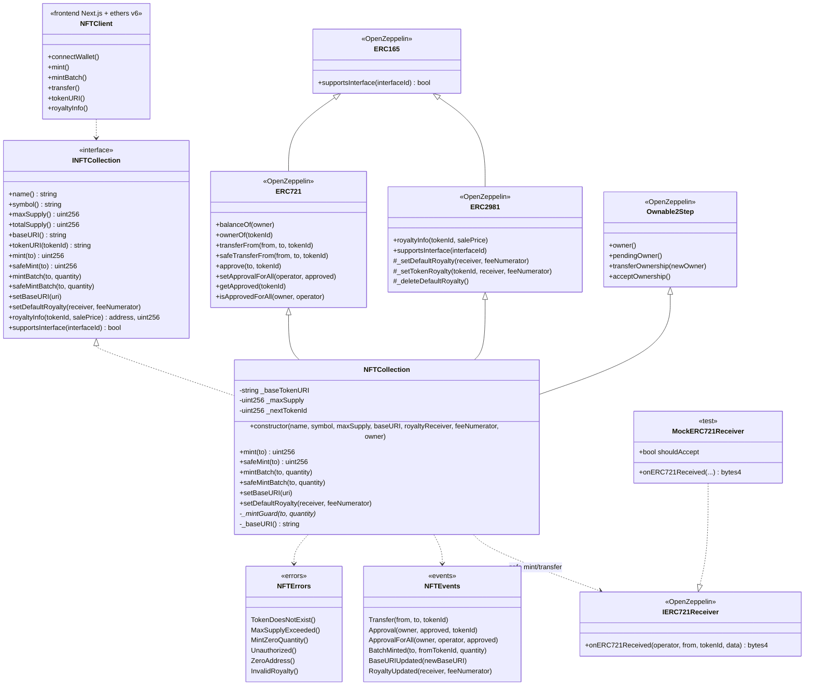

# Diagrama de clases — ERC-721 NFT Collection & Royalty

Vista estática del diseño previsto (v1) según `.cursorrules` del módulo 04. Se actualizará al cerrar implementación (Fase 7).

---

## 1. Diagrama de clases (Mermaid)



---

## 2. Responsabilidades

| Tipo | Responsabilidad |
|------|-----------------|
| `INFTCollection` | Superficie pública estable para tests, scripts y UI |
| `NFTCollection` | Mint/batch, URI, royalties, supply cap, admin |
| OZ `ERC721` | Ownership, transfers, approvals, safe receiver checks |
| OZ `ERC2981` | `royaltyInfo` y storage de fee/receiver |
| OZ `Ownable2Step` | Admin URI / royalty / ownership 2-step |
| `IERC721Receiver` | Hook obligatorio en destinos contrato (safe paths) |
| `MockERC721Receiver` | Tests de aceptación / rechazo del hook |
| `NFTClient` | Demo Fase 6 (`frontend/`) |

---

## 3. Estado crítico (modelo v1)

```text
Global:
  name / symbol          // ERC-721 metadata
  _maxSupply             // techo de mint
  _nextTokenId           // siguiente id a mintear (secuencial)
  _baseTokenURI          // raíz dinámica de metadata

Por token (heredado OZ ERC721):
  _owners[tokenId]
  _tokenApprovals[tokenId]

Por owner/operator:
  _balances[owner]
  _operatorApprovals[owner][operator]

Royalties (heredado OZ ERC2981):
  default royalty receiver + feeNumerator
  (opcional) royalty por tokenId
```

### Política de `tokenURI` (propuesta)

```text
tokenURI(tokenId) =
  existe(tokenId) ? string.concat(_baseTokenURI, tokenId.toString()) : revert TokenDoesNotExist()
```

Convención exacta (con/sin `/`, extensión `.json`) se congela en Fase 1.

---

## 4. Interface IDs a verificar

| Estándar | Interface ID (referencia) |
|----------|---------------------------|
| ERC-165 | `0x01ffc9a7` |
| ERC-721 | `0x80ac58cd` |
| ERC-721 Metadata | `0x5b5e139f` |
| ERC-2981 | `0x2a55205a` |

---

## 5. Layout Solidity (previsto)

1. SPDX + `pragma solidity 0.8.24;`
2. Imports OZ + interfaz
3. Custom errors / events (o en interfaz)
4. Estado (`_maxSupply`, `_nextTokenId`, `_baseTokenURI`)
5. Constructor
6. Views (`totalSupply`, `tokenURI`, `royaltyInfo`, `supportsInterface`)
7. Mint mutators → admin (`setBaseURI`, royalties) → overrides internos

---

## 6. Decisiones de diseño (v1 propuestas)

| Tema | Decisión |
|------|----------|
| Base de implementación | OpenZeppelin ERC721 + ERC2981 (no from-scratch) |
| Numeración `tokenId` | Secuencial desde **0** (`_nextTokenId` inicia en 0) |
| Mint público vs onlyOwner | **onlyOwner** en v1 (colección curada); mint abierto = fase extra |
| `mint` vs `safeMint` | Ambos; batch con variante safe |
| Royalty por token | Default obligatorio; per-token opcional en Fase 3 |
| `Pausable` | No en v1 |
| Enumerable / URIStorage OZ | No por defecto (gas); solo si se autoriza |
| Reveal / allowlist | Fuera de alcance v1 |
