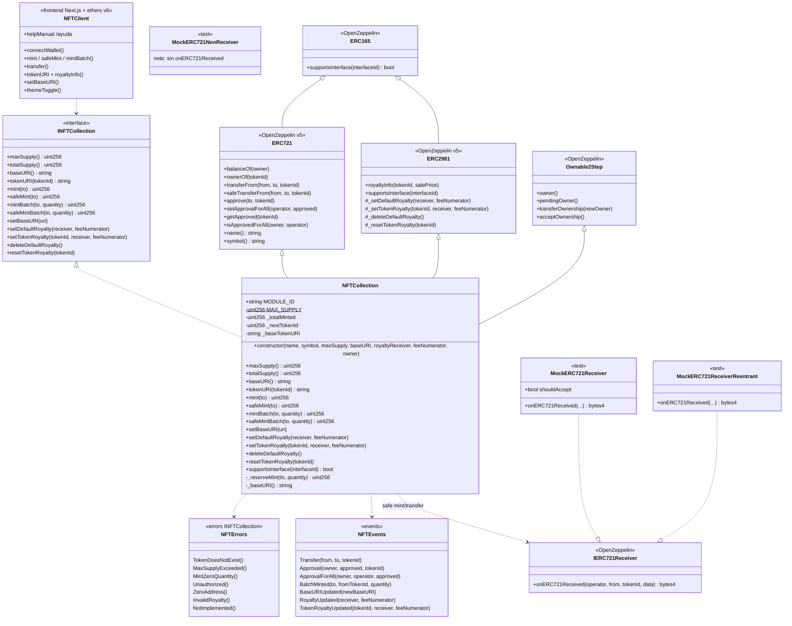

# Diagrama de clases — ERC-721 NFT Collection & Royalty

Vista **as-built** (Fase 7) alineada a `src/NFTCollection.sol` + `INFTCollection.sol` + demo `frontend/`.

---

## 1. Diagrama de clases (Mermaid)



---

## 2. Responsabilidades

| Tipo | Responsabilidad |
|------|-----------------|
| `INFTCollection` | Superficie pública estable (tests, scripts, UI) |
| `NFTCollection` | Mint/batch, URI, royalties, supply cap, admin |
| OZ `ERC721` | Ownership, transfers, approvals, safe receiver |
| OZ `ERC2981` | `royaltyInfo` + storage default/per-token |
| OZ `Ownable2Step` | Admin URI / royalty / ownership 2-step |
| `IERC721Receiver` | Hook en destinos contrato (safe paths) |
| Mocks | Aceptación, rechazo y reentrancy en tests |
| `NFTClient` | Demo Fase 6–7 (`frontend/`, tema + ayuda) |

---

## 3. Estado crítico (as-built)

```text
Global (NFTCollection):
  MODULE_ID               // constante "04-erc721"
  MAX_SUPPLY              // immutable
  _totalMinted            // totalSupply()
  _nextTokenId            // siguiente id (inicia en 0)
  _baseTokenURI           // raíz dinámica

Por token (OZ ERC721):
  _owners[tokenId]
  _tokenApprovals[tokenId]

Por owner/operator:
  _balances[owner]
  _operatorApprovals[owner][operator]

Royalties (OZ ERC2981):
  default royalty receiver + feeNumerator
  royalty por tokenId (opcional)
```

### Política de `tokenURI` (congelada)

```text
_requireOwned(tokenId)   // si no existe → error OZ / TokenDoesNotExist vía tests
base = _baseTokenURI
bytes(base).length > 0 ? concat(base, tokenId.toString()) : ""
```

Convención off-chain: terminar `baseURI` en `/` si el host lo requiere.

---

## 4. Interface IDs verificados

| Estándar | Interface ID |
|----------|----------------|
| ERC-165 | `0x01ffc9a7` |
| ERC-721 | `0x80ac58cd` |
| ERC-721 Metadata | `0x5b5e139f` |
| ERC-2981 | `0x2a55205a` |

---

## 5. Layout Solidity (implementado)

1. SPDX + `pragma solidity 0.8.24;`
2. Imports OZ + `INFTCollection`
3. Contrato: herencia `INFTCollection, ERC721, ERC2981, Ownable2Step`
4. Estado (`MAX_SUPPLY`, `_totalMinted`, `_nextTokenId`, `_baseTokenURI`)
5. Constructor
6. Views → mint mutators → admin URI/royalty → `_reserveMint` / `_baseURI` / `supportsInterface`

---

## 6. Decisiones de diseño (v1 cerradas)

| Tema | Decisión |
|------|----------|
| Base | OpenZeppelin ERC721 + ERC2981 |
| `tokenId` | Secuencial desde **0** |
| Mint | **onlyOwner** |
| `mint` / `safeMint` | Ambos + variantes batch |
| Royalty per-token | Sí (`set` / `reset`) + default |
| Pausable / Enumerable / URIStorage | No |
| Reveal / allowlist | Fuera de alcance |
