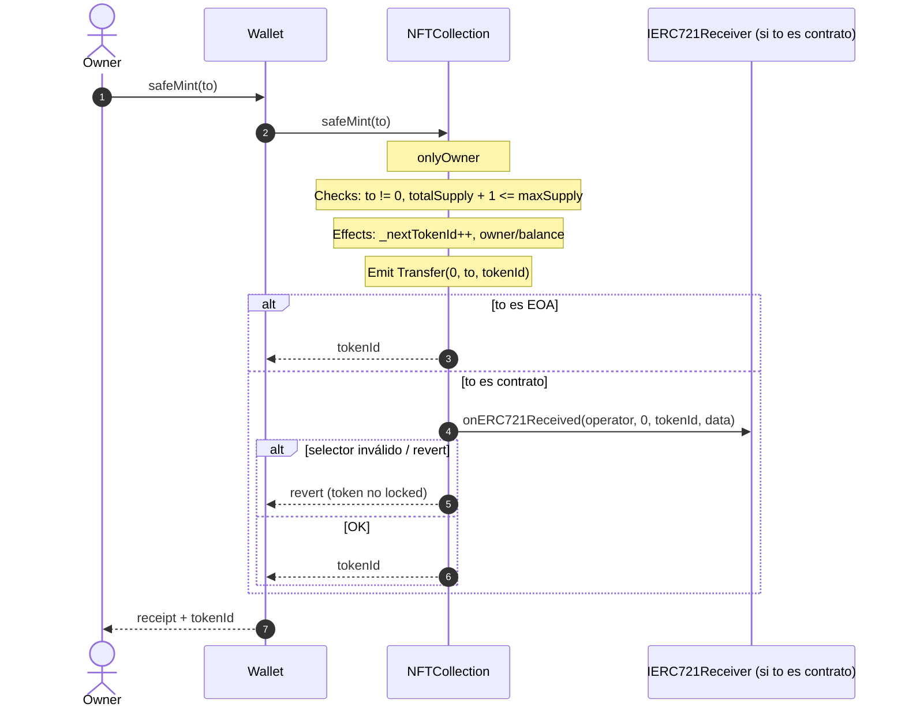
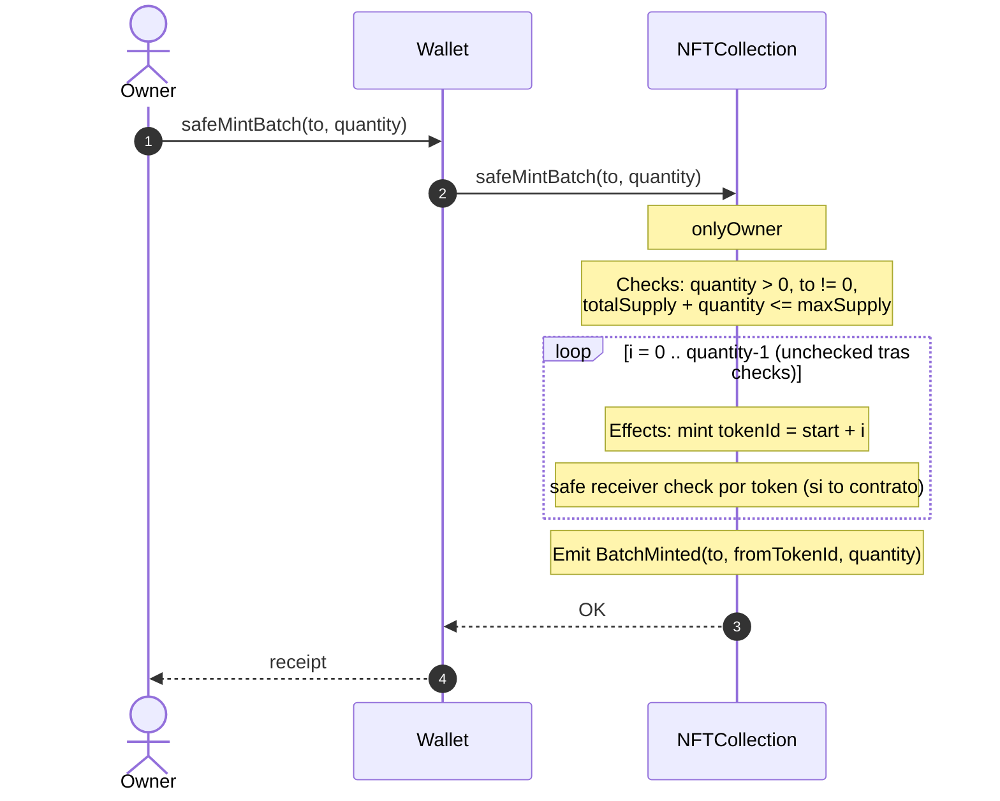
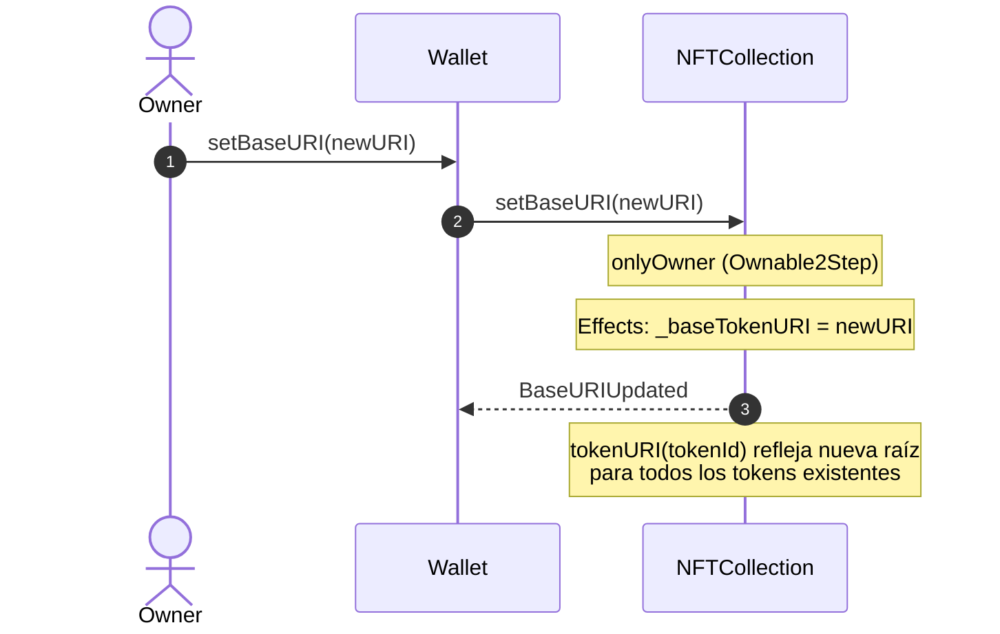
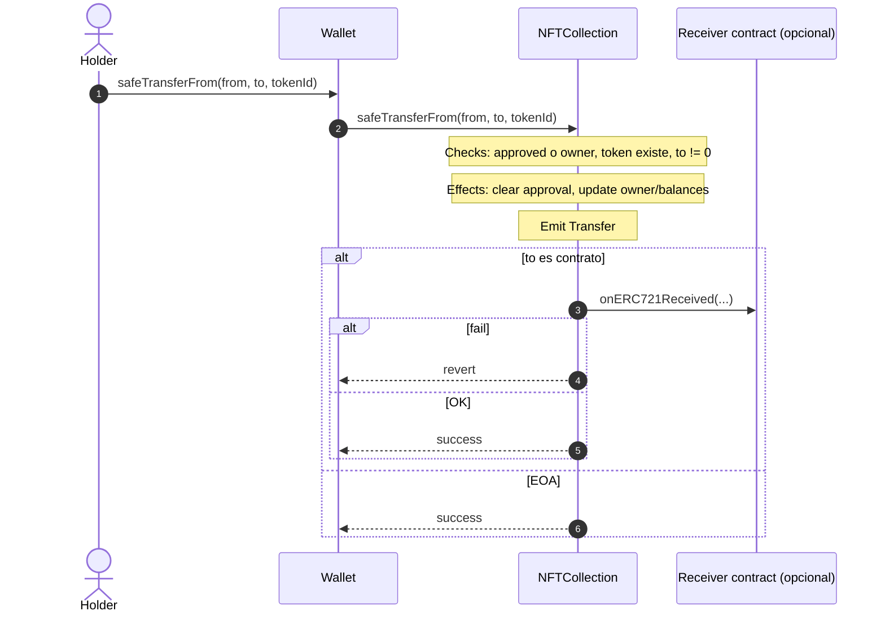
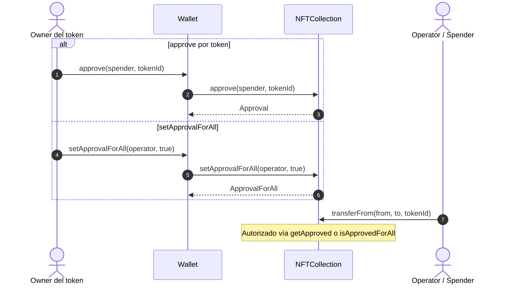
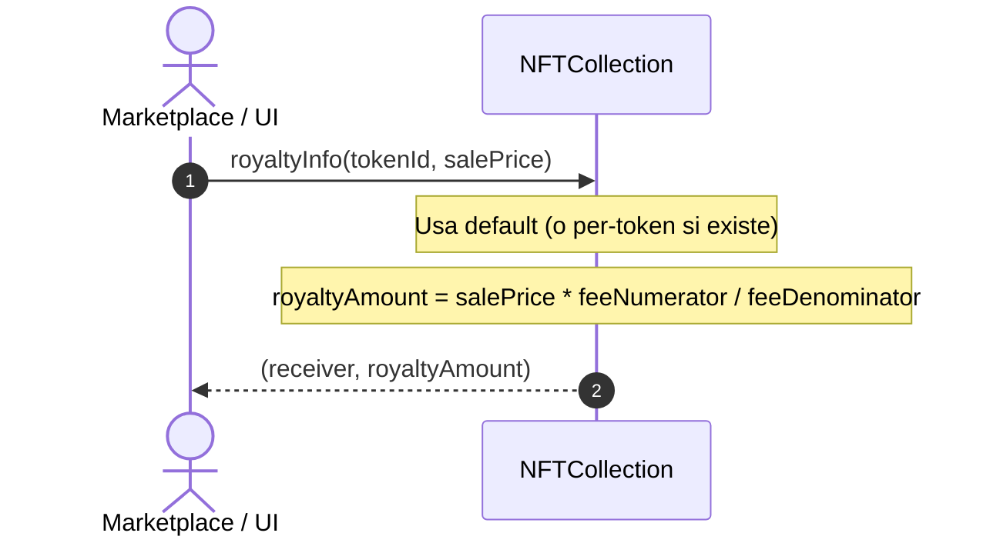
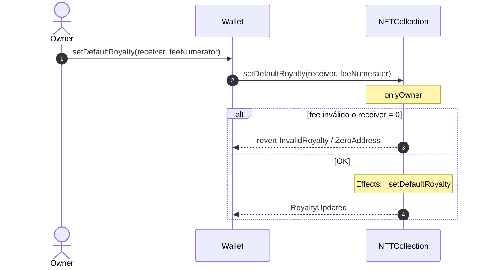
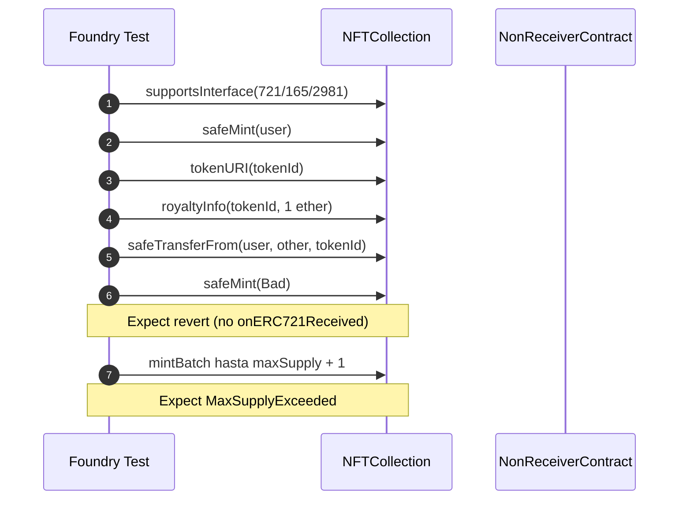
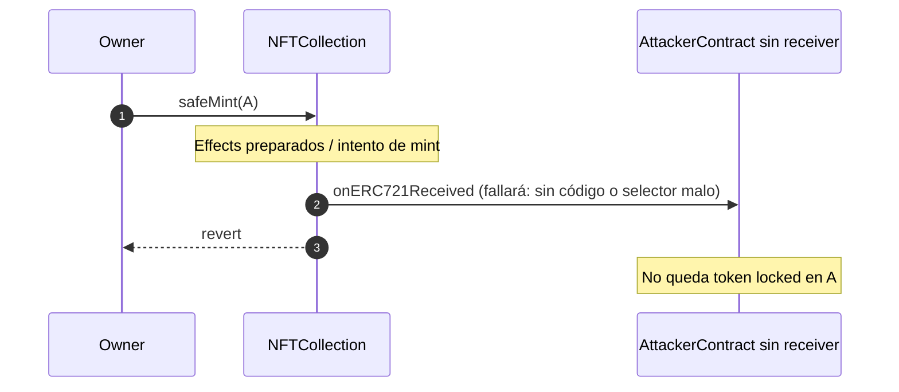

# Diagrama de flujo — ERC-721 NFT Collection & Royalty

Secuencias de interacción entre **usuario/owner**, **wallet/frontend** y **NFTCollection** (diseño v1). Complementa el [flujograma de decisiones](./03-flujograma.md). Plan: [`00-plan-implementacion.md`](./00-plan-implementacion.md).

---

## 1. Mint individual (`safeMint`)



---

## 2. Mint por lotes (`safeMintBatch`)



---

## 3. Actualización de Base URI



---

## 4. Transferencia segura entre usuarios



---

## 5. Approvals



---

## 6. Consulta de royalty (ERC-2981)



---

## 7. Configuración de royalty (admin)



---

## 8. Ownership 2-step (Ownable2Step)

```mermaid
sequenceDiagram
    autonumber
    actor O as Owner actual
    actor P as Nuevo owner
    participant N as NFTCollection

    O->>N: transferOwnership(P)
    Note over N: pendingOwner = P
    P->>N: acceptOwnership()
    Note over N: owner = P; pending limpio
    Note over O,P: Solo el owner aceptado puede setBaseURI / royalties / mint
```

---

## 9. Lifecycle de test (mint → URI → transfer → royalty → interface)



---

## 10. Safe mint a contrato malicioso / sin hook (debe fallar)


