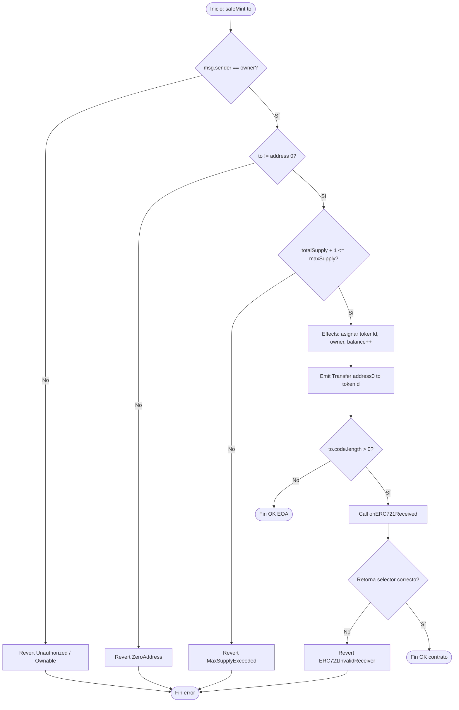
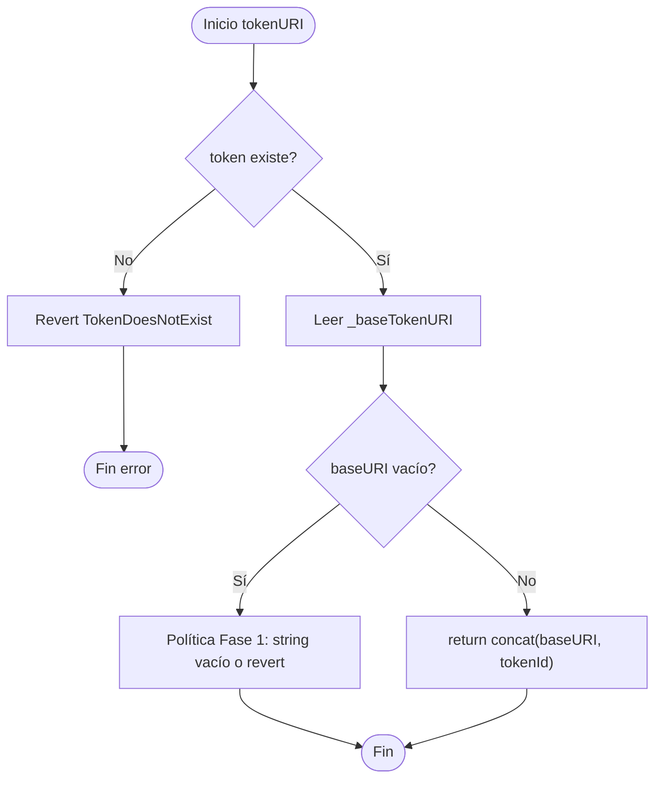
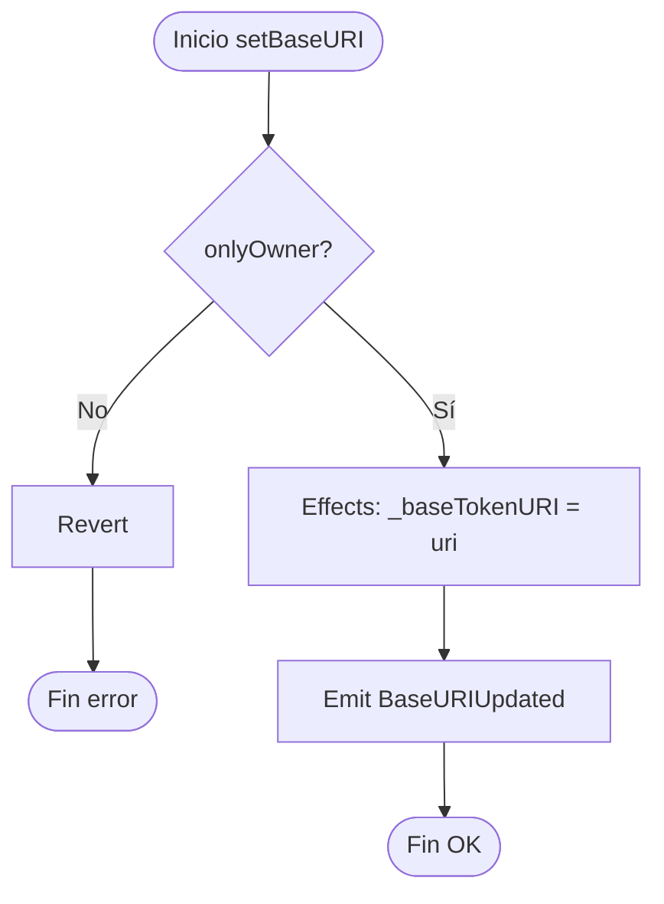
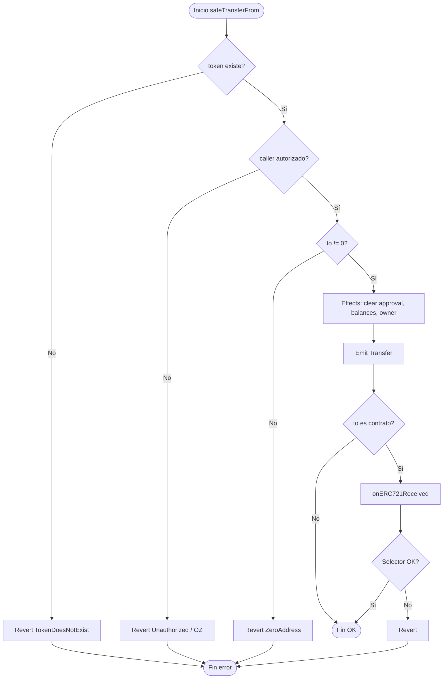
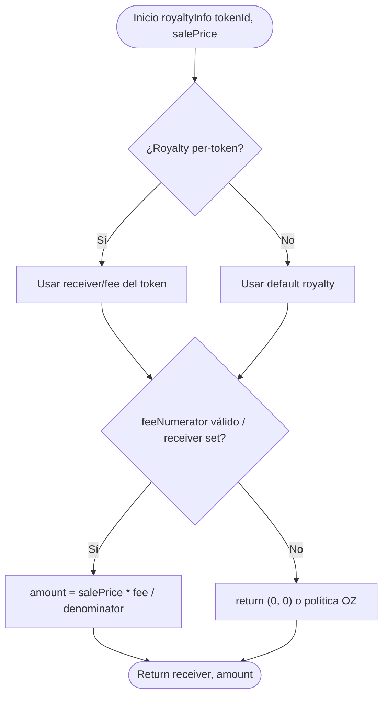
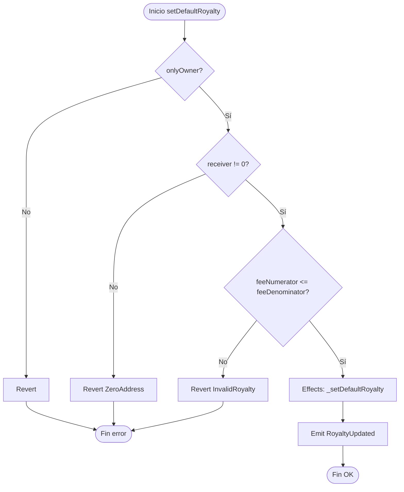
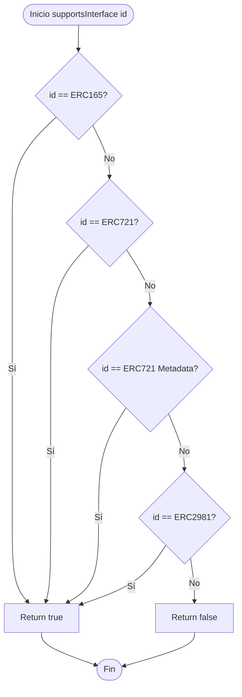
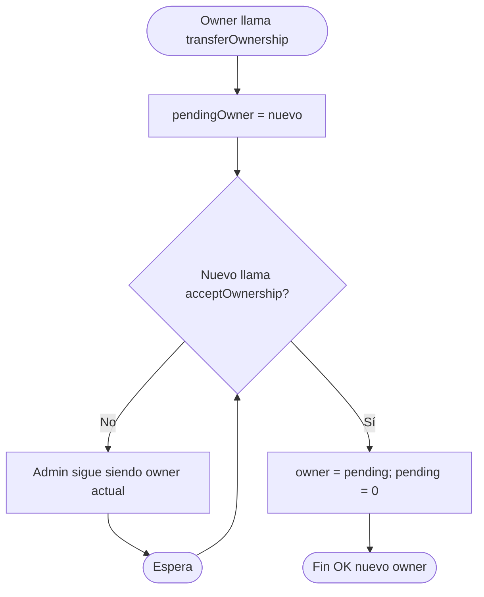
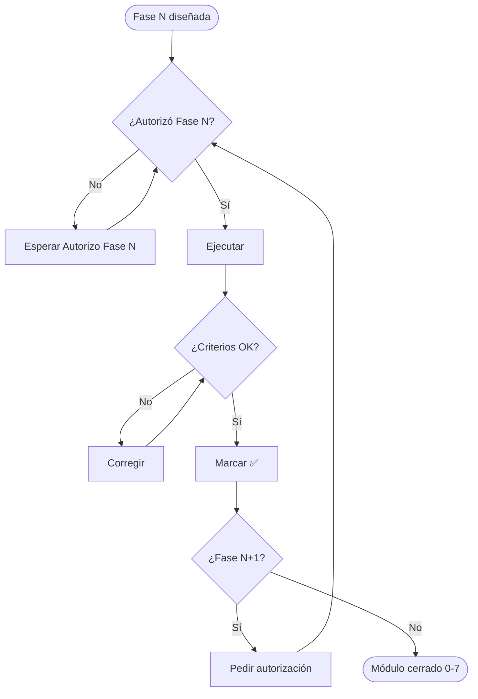

# Flujograma — ERC-721 NFT Collection & Royalty

Diagramas de decisión (sí/no) del diseño v1. Secuencias: [`02-diagrama-flujo.md`](./02-diagrama-flujo.md). Plan: [`00-plan-implementacion.md`](./00-plan-implementacion.md).

Orden típico en mutators de mint: `onlyOwner` → checks de dirección/quantity/supply → effects → (safe) interactions con receiver.

---

## 1. Flujograma: `safeMint(to)`



---

## 2. Flujograma: `mintBatch` / `safeMintBatch`

```mermaid
flowchart TD
    A([Inicio: mintBatch to, quantity]) --> B{onlyOwner?}
    B -->|No| C[Revert]
    C --> Z([Fin error])
    B -->|Sí| D{quantity > 0?}
    D -->|No| E[Revert MintZeroQuantity]
    E --> Z
    D -->|Sí| F{to != 0?}
    F -->|No| G[Revert ZeroAddress]
    G --> Z
    F -->|Sí| H{totalSupply + quantity <= maxSupply?}
    H -->|No| I[Revert MaxSupplyExceeded]
    I --> Z
    H -->|Sí| J[fromId = _nextTokenId]
    J --> K[Loop unchecked i = 0 .. quantity)
    K --> L[Mint token fromId + i]
    L --> M{Variante safe y to es contrato?}
    M -->|Sí| N[onERC721Received por token]
    N --> O{OK?}
    O -->|No| P[Revert]
    P --> Z
    O -->|Sí| Q{Más tokens?}
    M -->|No| Q
    Q -->|Sí| K
    Q -->|No| R[Emit BatchMinted]
    R --> S([Fin OK])
```

---

## 3. Flujograma: `tokenURI(tokenId)`



---

## 4. Flujograma: `setBaseURI`



---

## 5. Flujograma: `safeTransferFrom`



---

## 6. Flujograma: `royaltyInfo`



---

## 7. Flujograma: `setDefaultRoyalty`



---

## 8. Flujograma: `supportsInterface`



---

## 9. Flujograma: Ownable2Step (cambio de owner)



---

## 10. Flujograma: autorización de fases del módulo



---

## 11. Leyenda rápida

| Símbolo | Significado |
|---------|-------------|
| Óvalo | Inicio / fin |
| Rectángulo | Proceso o efecto |
| Rombo | Decisión |
| CEI | Checks → Effects → Interactions (donde hay calls externos) |
| Safe path | Exige `onERC721Received` si `to` es contrato |
| Batch guard | Validar supply/quantity **antes** del loop `unchecked` |
| Ownable2Step | Admin solo tras `acceptOwnership` |
